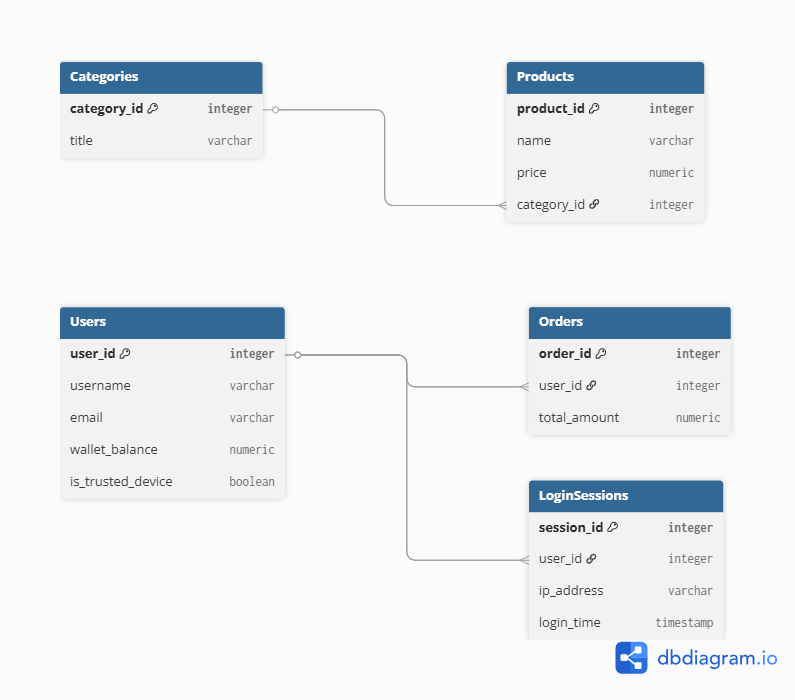

# Лабораторна робота №1
**Тема:** Проектування БД ігрового маркетплейсу з елементами безпеки (аналог Steam Guard)

## 1. Опис предметної області
Система керує продажем ігрових товарів та відстежує безпеку входів користувачів з різних пристроїв.

## 2. Сутності (Таблиці)
* **User:** дані гравця та прив'язка довіреного пристрою.
* **Session:** історія входів (IP, пристрій, час).
* **Product:** ігрові предмети.
* **Order:** транзакції покупок.

## 3. Зв'язки
* **User ↔ Session:** Один-до-багатьох (користувач може заходити з різних ПК).
* **User ↔ Order:** Один-до-багатьох (історія покупок одного гравця).
## ER-діаграма
