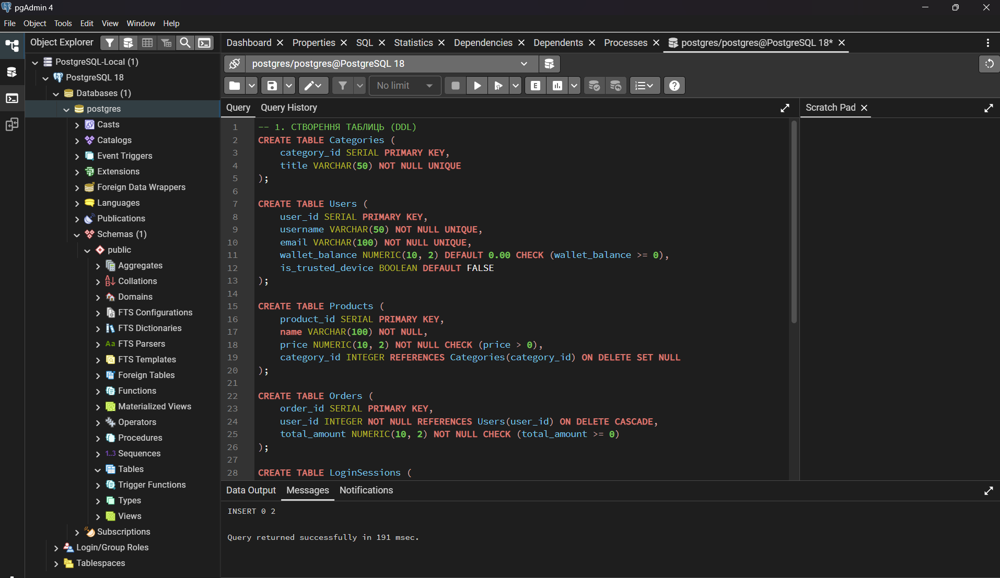
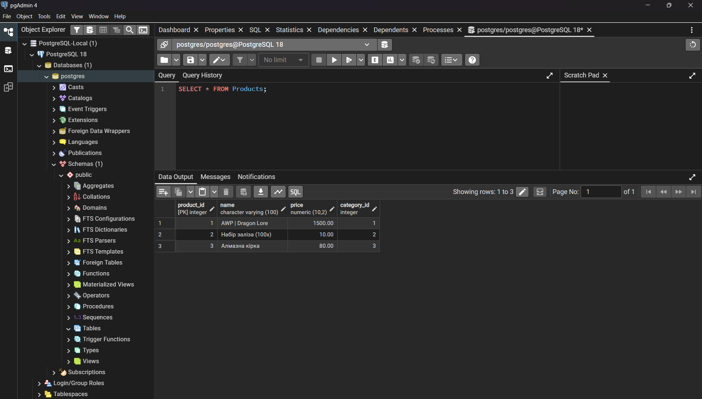

# Лабораторна робота №2: Перетворення ER-діаграми на схему PostgreSQL

**Студент:** Михайло Савчук
**Група:** ІО-45
**Варіант:** 14

## 1. Цілі роботи
* Написати SQL DDL-інструкції для створення таблиць на основі ER-діаграми з Лабораторної роботи №1.
* Визначити типи даних, первинні (PK) та зовнішні (FK) ключі.
* Додати обмеження: `UNIQUE`, `NOT NULL`, та `CHECK` для валідації даних.
* Вставити принаймні 3–5 рядків тестових даних у кожну таблицю.
* Протестувати роботу схеми в pgAdmin.

## 2. Опис реляційної схеми
Схема реалізує базу даних для ігрового маркетплейсу:

| Таблиця | Опис | Ключі та обмеження |
| :--- | :--- | :--- |
| **Categories** | Категорії товарів (Skins, Tools тощо) | `PK: category_id`, `UNIQUE: title` |
| **Users** | Дані гравців та їх гаманець | `PK: user_id`, `UNIQUE: email`, `CHECK (wallet_balance >= 0)` |
| **Products** | Ігрові предмети на продаж | `PK: product_id`, `FK: category_id`, `CHECK (price > 0)` |
| **Orders** | Історія транзакцій покупок | `PK: order_id`, `FK: user_id`, `NOT NULL: total_amount` |
| **LoginSessions** | Журнал безпеки входів (Steam Guard) | `PK: session_id`, `FK: user_id`, `TIMESTAMP` |

## 3. SQL Код
Повний скрипт (DDL + DML) знаходиться за посиланням:
[./sql/solution.sql](./sql/solution.sql)

## 4. Результати тестування

### Створення таблиць та вставка даних
На скріншоті нижче видно успішне виконання всього SQL-скрипта (повідомлення "Query returned successfully"):

### Перевірка наповнення таблиць
Результат виконання запиту `SELECT * FROM Products;`, що підтверджує коректність вставки тестових даних:

